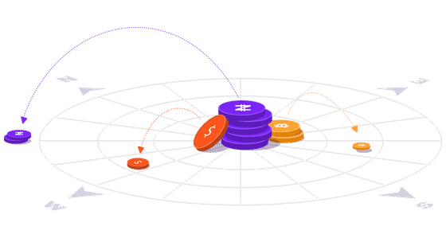

[Home](README.md) - [Chapter 1](1-accounts.md) - [Chapter 2](2-payments.md) - [Chapter 3](3-assets.md) - [Chapter 4](4-decentralized-exchange.md) - [Chapter 5](5-path-payments.md) - [Conclusion](6-conclusion.md) - [Bonus Chapter 1](bonus-xdr.md) - [Bonus Chapter 2](bonus-streaming.md)

## Chapter 2 - Payments on Stellar

<div align="center"></div>
<br>

For the official documentation on payments - [go here](https://www.stellar.org/developers/guides/concepts/list-of-operations.html#payment).

As a Stellar user, you have the option to execute many types of [operations](https://www.stellar.org/developers/guides/concepts/operations.html). Payments are one type of operation and are simply the sending of a specific amount of an asset to a destination.

**Note**: On Stellar, transactions contain a *list of operations* and other relevant information such as fees, signatures, etc. In short, transactions are simply commands that alter the state of the ledger. Each operation you add to a transaction costs a **base fee** of 100 stroops (0.00001 lumens), so the total transaction fee is the number of operations multiplied by the base fee. For the official documentation on transactions - [go here](https://www.stellar.org/developers/guides/concepts/transactions.html).

### Sending a Payment

Before sending our first payment, we need to generate a new address to serve as our payment destination. Run the ```generate_keypair()``` function we created in the previous chapter to get a new address and fund it using Friendbot.

You should now have keys for two accounts, both with 10,000 lumens to send:

```
Account A
Public key: GBG7D5ZZJLAKPDBAGSVS3O3TMIV2O3HOIOXE2OSGGCYNRATOICDRTIAR
Private key: SBK4EAZIWXELREKEXP4WB6DCCMJH7SGTEQE2BJALA32VQQ4ADFAWJGOV
```
```
Account B
Public key: GCF4PQGCOFR245LDPRMBDGMD7VQMOGF2KQZJAWICB6JJ337NDPUQR66E
Private key: SCO4JEHDN2ZLIDZMZC62UR6Y5NICMTMRKBPG3JMBKI5AHVXJA46MY2VG
```

To send our first payment from ```Account A``` to ```Account B```, we'll write a script that builds a transaction for our payment operation and checks if that transaction was successful - I'll explain how it all works in the next section:

``` python
from stellar_sdk import Server, Keypair, TransactionBuilder, Network
from stellar_sdk.xdr import Xdr
from stellar_sdk.xdr.StellarXDR_const import TransactionResultCode
import json
import base64

def tx_success(result_xdr):
    xdr_decoded = base64.b64decode(result_xdr.encode())
    unpacker = Xdr.StellarXDRUnpacker(xdr_decoded)
    xdr_obj = unpacker.unpack_TransactionResult()
    print('Transaction result:', TransactionResultCode.get(xdr_obj.result.code))

def send_payment(signing_key, receiving_key, amount, asset='XLM'):
    # Derive Keypair object and public key from the signing key (source account)
    source_keypair = Keypair.from_secret(signing_key)
    source_public_key = source_keypair.public_key

    # Account receiving funds
    receiving_key = receiving_key

    # Talk to testnet horizon instance
    server = Server(horizon_url="https://horizon-testnet.stellar.org")

    # Fetch the current sequence number for the source account from Horizon.
    source_account = server.load_account(source_public_key)

    # Build transaction
    transaction = (
        TransactionBuilder(
            source_account=source_account,
            network_passphrase=Network.TESTNET_NETWORK_PASSPHRASE,
            base_fee=100,
        )
        .append_payment_op(receiving_key, amount, asset)
        .build()
    )

    transaction.sign(source_keypair)

    # Submit the transaction to Horizon and check if successful
    response = server.submit_transaction(transaction)
    result_xdr = response.get('result_xdr')
    tx_success(result_xdr)
    print(json.dumps(response, indent=2))

if __name__ == '__main__':
    # Account A Signing Key: SBK4EAZIWXELREKEXP4WB6DCCMJH7SGTEQE2BJALA32VQQ4ADFAWJGOV
    # Account B Public Key: GCF4PQGCOFR245LDPRMBDGMD7VQMOGF2KQZJAWICB6JJ337NDPUQR66E
    send_payment('SBCQT2KDQNBP3H4ONGLCY2QRD2EXDMVG7REODUIPWRBTENAIGCHTBD6V', 'GCCNQCV26F4DZVOOKQBNZBW7JNXDRNHNCSVGYQOXKX27RWEAXWCMH3IZ', '100')
 ```

Run the script and if everything went according to plan, you should've gotten a response like this:
``` json
Transaction result: txSUCCESS
{
  "_links": {
    "transaction": {
      "href": "https://horizon-testnet.stellar.org/transactions/ab2391d09a662b3d94ee274f54015542906613034142ad16dc35a69377836b5a"
    }
  },
  "hash": "ab2391d09a662b3d94ee274f54015542906613034142ad16dc35a69377836b5a",
  "ledger": 654261,
  "envelope_xdr": "AAAAAE3x9zlKwKeMIDSrLbtzYiunbO5Drk06RjCw2IJuQIcZAAAAZAAIScQAAAABAAAAAAAAAAAAAAABAAAAAAAAAAEAAAAAi8fAwnFjrnVjfFgRmYP9YMcYulQykFkCD5Kd7+0b6QgAAAAAAAAAADuaygAAAAAAAAAAAW5AhxkAAABA59dY2rInjjirjX43z8rStBUejRpUzxnELfZe4kiU55N0ms8TUxaG6iapCRXVFxR3PDbEqlUwzXvR/E31rnsQBw==",
  "result_xdr": "AAAAAAAAAGQAAAAAAAAAAQAAAAAAAAABAAAAAAAAAAA=",
  "result_meta_xdr": "AAAAAQAAAAIAAAADAAn7tQAAAAAAAAAATfH3OUrAp4wgNKstu3NiK6ds7kOuTTpGMLDYgm5AhxkAAAAXSHbnnAAIScQAAAAAAAAAAAAAAAAAAAAAAAAAAAEAAAAAAAAAAAAAAAAAAAAAAAABAAn7tQAAAAAAAAAATfH3OUrAp4wgNKstu3NiK6ds7kOuTTpGMLDYgm5AhxkAAAAXSHbnnAAIScQAAAABAAAAAAAAAAAAAAAAAAAAAAEAAAAAAAAAAAAAAAAAAAAAAAABAAAABAAAAAMACIU9AAAAAAAAAACLx8DCcWOudWN8WBGZg/1gxxi6VDKQWQIPkp3v7RvpCAAAABdIdugAAAiFPQAAAAAAAAAAAAAAAAAAAAAAAAAAAQAAAAAAAAAAAAAAAAAAAAAAAAEACfu1AAAAAAAAAACLx8DCcWOudWN8WBGZg/1gxxi6VDKQWQIPkp3v7RvpCAAAABeEEbIAAAiFPQAAAAAAAAAAAAAAAAAAAAAAAAAAAQAAAAAAAAAAAAAAAAAAAAAAAAMACfu1AAAAAAAAAABN8fc5SsCnjCA0qy27c2Irp2zuQ65NOkYwsNiCbkCHGQAAABdIduecAAhJxAAAAAEAAAAAAAAAAAAAAAAAAAAAAQAAAAAAAAAAAAAAAAAAAAAAAAEACfu1AAAAAAAAAABN8fc5SsCnjCA0qy27c2Irp2zuQ65NOkYwsNiCbkCHGQAAABcM3B2cAAhJxAAAAAEAAAAAAAAAAAAAAAAAAAAAAQAAAAAAAAAAAAAAAAAAAA=="
}
```

Now we can run ```show_balance_data()``` that we created last chapter and take a look at both accounts:

```
Account A
Public key: GD7YLRC3YWR3SMVGY3TSQ2UL56D7SG3JDIGYPNYZ2G22HBMOX5S7CLYF
Last modified ledger: 4679
Lumen Balance: 9899.9999800
```
```
Account B
Public key: GACNGVOSMX7NUBKUEPU26FQ2ROQZRVZ6IGGPESEHNGEKNRS55OUWU2YG
Last modified ledger: 4679
Lumen Balance: 10100.0000000
```

Perfect, it worked 😎 Let's look under the hood and see what we did.

### Unpacking the Payment

To understand what's going on we first need to understand what the ```send_payment()``` function we created does:

``` python
def send_payment(signing_key, receiving_key, amount):
    builder = Builder(secret=signing_key, horizon_uri='https://horizon-testnet.stellar.org' , network='testnet') \
        .add_text_memo("Here's some lumens!") \
        .append_payment_op(destination=receiving_key, asset_code='XLM', amount=amount)
    # Sign and submit transaction -> print response
    builder.sign()
    response = builder.submit()
    print(json.dumps(response, indent = 2))
```

```send_payment()``` takes 3 parameters that serve as the basic building blocks of a payment. The ```signing_key``` is the private key of the account who wishes to send the payment, the ```receiving_key``` is the public key of the account we are sending the payment *to* and ```amount``` is simply the amount of the asset we are trying to send.

Our script also adds a memo to the transaction and could have a parameter specified, but I left it out for simplicity. Memo's are an optional attribute for transactions and contain extra information. In this case I included a note that says "Here's some lumens!"

Memos can also have several types such as ```MEMO_TEXT``` (what we used), ```MEMO_ID```, ```MEMO_HASH```, ```MEMO_RETURN```. Read more about memos [here](https://www.stellar.org/developers/guides/concepts/transactions.html#memo).

Next, we create a [Builder](https://stellar-base.readthedocs.io/en/latest/api.html#builder) object provided by the Python Stellar SDK -  passing in the signing key, horizon instance, and network we are using. We then finish constructing the transaction by attaching a memo and a payment operation.

**Note**: If desired, a fee parameter can also be specified in the Builder object, by default it obtains the base fee from the latest ledger.

The Builder object then creates a ***Transaction Envelope*** that will be submitted to Horizon. A Transaction Envelope is an object that contains the transaction object itself and a set of signatures (in this case one signature). The transaction object contains the source account, fee, sequence number, the list of operations, list of signatures, memo, and time bounds. You have the option to set these parameters when using the Builder object, otherwise the SDK handles it for you.

After building our transaction, ```builder.sign()``` is used to sign the TransactionEnvelope with the secret key we provided. Then ```builder.submit()``` submits the [XDR object](https://www.stellar.org/developers/horizon/reference/xdr.html) of the transaction envelope to Horizon and returns a JSON response:

``` json
{
  "_links": {
    "transaction": {
      "href": "https://horizon-testnet.stellar.org/transactions/1ca91dc5589e9ee293e6429396214f3e38ed7d65b541fdddac2e70165be97259"
    }
  },
  "hash": "1ca91dc5589e9ee293e6429396214f3e38ed7d65b541fdddac2e70165be97259",
  "ledger": 4679,
  "envelope_xdr": "AAAAAP+FxFvFo7kypsbnKGqL74f5G2kaDYe3GdG1o4WOv2XxAAAAyAAAEeoAAAABAAAAAAAAAAEAAAATSGVyZSdzIHNvbWUgbHVtZW5zIQAAAAACAAAAAAAAAAEAAAAABNNV0mX+2gVUI+mvFhqLoZjXPkGM8kiHaYimxl3rqWoAAAAAAAAAADuaygAAAAAAAAAABQAAAAAAAAAAAAAAAAAAAAAAAAAAAAAAAAAAAAAAAAABAAAAC2ZlZC5uZXR3b3JrAAAAAAAAAAAAAAAAAY6/ZfEAAABApvgdnq5Tq80aR9FymeQBJAWXgHhMtcpjX59PC3ARtKNaHg5jlePBATov3KLtI9n3f8vOVPbYZ4yOU0xY8WFpAA==",
  "result_xdr": "AAAAAAAAAMgAAAAAAAAAAgAAAAAAAAABAAAAAAAAAAAAAAAFAAAAAAAAAAA=",
  "result_meta_xdr": "AAAAAQAAAAIAAAADAAASRwAAAAAAAAAA/4XEW8WjuTKmxucoaovvh/kbaRoNh7cZ0bWjhY6/ZfEAAAAXSHbnOAAAEeoAAAAAAAAAAAAAAAAAAAAAAAAAAAEAAAAAAAAAAAAAAAAAAAAAAAABAAASRwAAAAAAAAAA/4XEW8WjuTKmxucoaovvh/kbaRoNh7cZ0bWjhY6/ZfEAAAAXSHbnOAAAEeoAAAABAAAAAAAAAAAAAAAAAAAAAAEAAAAAAAAAAAAAAAAAAAAAAAACAAAABAAAAAMAABIoAAAAAAAAAAAE01XSZf7aBVQj6a8WGouhmNc+QYzySIdpiKbGXeupagAAABdIdugAAAASKAAAAAAAAAAAAAAAAAAAAAAAAAAAAQAAAAAAAAAAAAAAAAAAAAAAAAEAABJHAAAAAAAAAAAE01XSZf7aBVQj6a8WGouhmNc+QYzySIdpiKbGXeupagAAABeEEbIAAAASKAAAAAAAAAAAAAAAAAAAAAAAAAAAAQAAAAAAAAAAAAAAAAAAAAAAAAMAABJHAAAAAAAAAAD/hcRbxaO5MqbG5yhqi++H+RtpGg2HtxnRtaOFjr9l8QAAABdIduc4AAAR6gAAAAEAAAAAAAAAAAAAAAAAAAAAAQAAAAAAAAAAAAAAAAAAAAAAAAEAABJHAAAAAAAAAAD/hcRbxaO5MqbG5yhqi++H+RtpGg2HtxnRtaOFjr9l8QAAABcM3B04AAAR6gAAAAEAAAAAAAAAAAAAAAAAAAAAAQAAAAAAAAAAAAAAAAAAAAAAAAIAAAADAAASRwAAAAAAAAAA/4XEW8WjuTKmxucoaovvh/kbaRoNh7cZ0bWjhY6/ZfEAAAAXDNwdOAAAEeoAAAABAAAAAAAAAAAAAAAAAAAAAAEAAAAAAAAAAAAAAAAAAAAAAAABAAASRwAAAAAAAAAA/4XEW8WjuTKmxucoaovvh/kbaRoNh7cZ0bWjhY6/ZfEAAAAXDNwdOAAAEeoAAAABAAAAAAAAAAAAAAAAAAAAC2ZlZC5uZXR3b3JrAAEAAAAAAAAAAAAAAAAAAAA="
}
```

For this walkthrough, the important part of the response is the transaction link ```"href": "https://horizon-testnet.stellar.org/transactions/1ca91dc5589e9ee293e6429396214f3e38ed7d65b541fdddac2e70165be97259"```.

Visiting link gives us a response with some details that are useful when we want certain information about a transaction:

``` json
{
  "memo": "Here's some lumens!",
  "_links": {
    "self": {
      "href": "https://horizon-testnet.stellar.org/transactions/1ca91dc5589e9ee293e6429396214f3e38ed7d65b541fdddac2e70165be97259"
    },
    "account": {
      "href": "https://horizon-testnet.stellar.org/accounts/GD7YLRC3YWR3SMVGY3TSQ2UL56D7SG3JDIGYPNYZ2G22HBMOX5S7CLYF"
    },
    "ledger": {
      "href": "https://horizon-testnet.stellar.org/ledgers/4679"
    },
    "operations": {
      "href": "https://horizon-testnet.stellar.org/transactions/1ca91dc5589e9ee293e6429396214f3e38ed7d65b541fdddac2e70165be97259/operations{?cursor,limit,order}",
      "templated": true
    },
    "effects": {
      "href": "https://horizon-testnet.stellar.org/transactions/1ca91dc5589e9ee293e6429396214f3e38ed7d65b541fdddac2e70165be97259/effects{?cursor,limit,order}",
      "templated": true
    },
    "precedes": {
      "href": "https://horizon-testnet.stellar.org/transactions?order=asc\u0026cursor=20096151986176"
    },
    "succeeds": {
      "href": "https://horizon-testnet.stellar.org/transactions?order=desc\u0026cursor=20096151986176"
    }
  },
  "id": "1ca91dc5589e9ee293e6429396214f3e38ed7d65b541fdddac2e70165be97259",
  "paging_token": "20096151986176",
  "successful": true,
  "hash": "1ca91dc5589e9ee293e6429396214f3e38ed7d65b541fdddac2e70165be97259",
  "ledger": 4679,
  "created_at": "2019-07-31T16:19:23Z",
  "source_account": "GD7YLRC3YWR3SMVGY3TSQ2UL56D7SG3JDIGYPNYZ2G22HBMOX5S7CLYF",
  "source_account_sequence": "19696720019457",
  "fee_paid": 200,
  "fee_charged": 200,
  "max_fee": 200,
  "operation_count": 2,
  "envelope_xdr": "AAAAAP+FxFvFo7kypsbnKGqL74f5G2kaDYe3GdG1o4WOv2XxAAAAyAAAEeoAAAABAAAAAAAAAAEAAAATSGVyZSdzIHNvbWUgbHVtZW5zIQAAAAACAAAAAAAAAAEAAAAABNNV0mX+2gVUI+mvFhqLoZjXPkGM8kiHaYimxl3rqWoAAAAAAAAAADuaygAAAAAAAAAABQAAAAAAAAAAAAAAAAAAAAAAAAAAAAAAAAAAAAAAAAABAAAAC2ZlZC5uZXR3b3JrAAAAAAAAAAAAAAAAAY6/ZfEAAABApvgdnq5Tq80aR9FymeQBJAWXgHhMtcpjX59PC3ARtKNaHg5jlePBATov3KLtI9n3f8vOVPbYZ4yOU0xY8WFpAA==",
  "result_xdr": "AAAAAAAAAMgAAAAAAAAAAgAAAAAAAAABAAAAAAAAAAAAAAAFAAAAAAAAAAA=",
  "result_meta_xdr": "AAAAAQAAAAIAAAADAAASRwAAAAAAAAAA/4XEW8WjuTKmxucoaovvh/kbaRoNh7cZ0bWjhY6/ZfEAAAAXSHbnOAAAEeoAAAAAAAAAAAAAAAAAAAAAAAAAAAEAAAAAAAAAAAAAAAAAAAAAAAABAAASRwAAAAAAAAAA/4XEW8WjuTKmxucoaovvh/kbaRoNh7cZ0bWjhY6/ZfEAAAAXSHbnOAAAEeoAAAABAAAAAAAAAAAAAAAAAAAAAAEAAAAAAAAAAAAAAAAAAAAAAAACAAAABAAAAAMAABIoAAAAAAAAAAAE01XSZf7aBVQj6a8WGouhmNc+QYzySIdpiKbGXeupagAAABdIdugAAAASKAAAAAAAAAAAAAAAAAAAAAAAAAAAAQAAAAAAAAAAAAAAAAAAAAAAAAEAABJHAAAAAAAAAAAE01XSZf7aBVQj6a8WGouhmNc+QYzySIdpiKbGXeupagAAABeEEbIAAAASKAAAAAAAAAAAAAAAAAAAAAAAAAAAAQAAAAAAAAAAAAAAAAAAAAAAAAMAABJHAAAAAAAAAAD/hcRbxaO5MqbG5yhqi++H+RtpGg2HtxnRtaOFjr9l8QAAABdIduc4AAAR6gAAAAEAAAAAAAAAAAAAAAAAAAAAAQAAAAAAAAAAAAAAAAAAAAAAAAEAABJHAAAAAAAAAAD/hcRbxaO5MqbG5yhqi++H+RtpGg2HtxnRtaOFjr9l8QAAABcM3B04AAAR6gAAAAEAAAAAAAAAAAAAAAAAAAAAAQAAAAAAAAAAAAAAAAAAAAAAAAIAAAADAAASRwAAAAAAAAAA/4XEW8WjuTKmxucoaovvh/kbaRoNh7cZ0bWjhY6/ZfEAAAAXDNwdOAAAEeoAAAABAAAAAAAAAAAAAAAAAAAAAAEAAAAAAAAAAAAAAAAAAAAAAAABAAASRwAAAAAAAAAA/4XEW8WjuTKmxucoaovvh/kbaRoNh7cZ0bWjhY6/ZfEAAAAXDNwdOAAAEeoAAAABAAAAAAAAAAAAAAAAAAAAC2ZlZC5uZXR3b3JrAAEAAAAAAAAAAAAAAAAAAAA=",
  "fee_meta_xdr": "AAAAAgAAAAMAABHqAAAAAAAAAAD/hcRbxaO5MqbG5yhqi++H+RtpGg2HtxnRtaOFjr9l8QAAABdIdugAAAAR6gAAAAAAAAAAAAAAAAAAAAAAAAAAAQAAAAAAAAAAAAAAAAAAAAAAAAEAABJHAAAAAAAAAAD/hcRbxaO5MqbG5yhqi++H+RtpGg2HtxnRtaOFjr9l8QAAABdIduc4AAAR6gAAAAAAAAAAAAAAAAAAAAAAAAAAAQAAAAAAAAAAAAAAAAAAAA==",
  "memo_type": "text",
  "signatures": [
    "pvgdnq5Tq80aR9FymeQBJAWXgHhMtcpjX59PC3ARtKNaHg5jlePBATov3KLtI9n3f8vOVPbYZ4yOU0xY8WFpAA=="
  ]
}
```

From the response, we can confirm that the transaction was successful by checking ```"successful": true```. This is important because failed transactions can also be included in the ledger. We can also get information such as ```fee_paid```, ```operation_count```, and the ```memo``` that was included. As of right now this isn't handled for you by the SDK. You'll have to write something to manually check that a transaction was successful.  

**Note**: The ```operation_count``` in my response is 2, *yours* should be 1. In the original draft of the ```send_payment()``` example I included another operation that I decided to later remove for simplicity. I also have a ```fee_paid``` of 200 stroops due to the extra operation, you should have ```fee_paid: 100```. Remember: transaction fee = base fee * operation count.

Now that you have some experience creating and sending payments, try sending different amounts back and forth between your accounts and getting familar with the responses from Horizon.

Next we'll learn about Stellar assets and create one of our own.

→ [Chapter 3 - Assets](3-assets.md)
